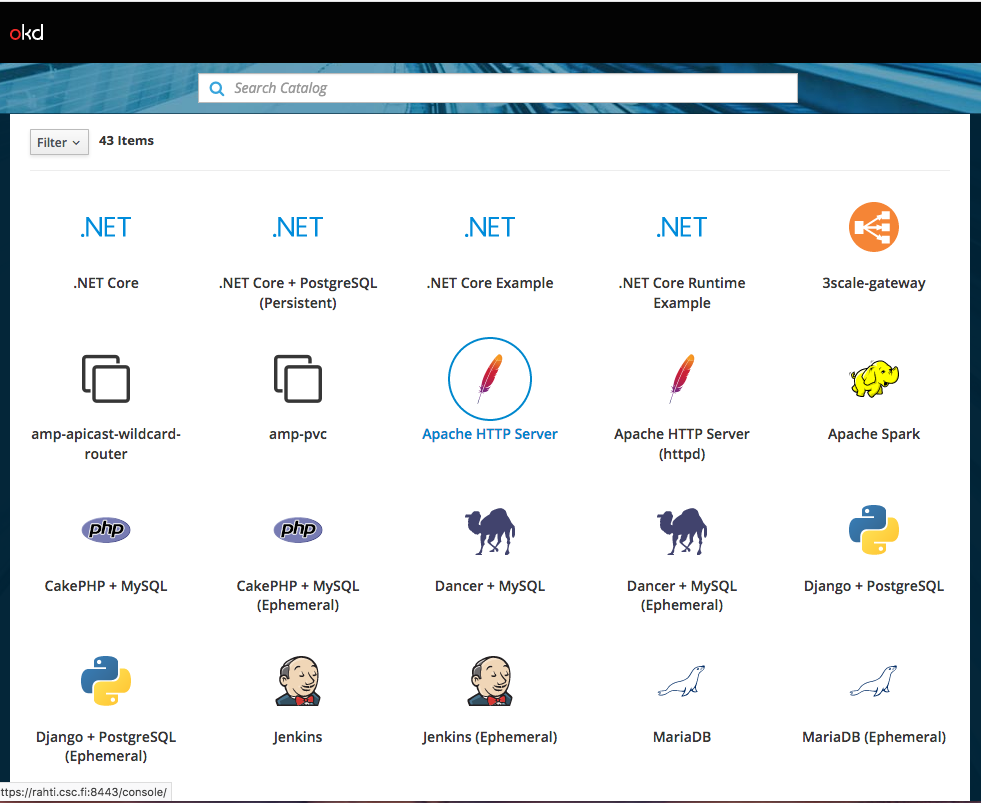
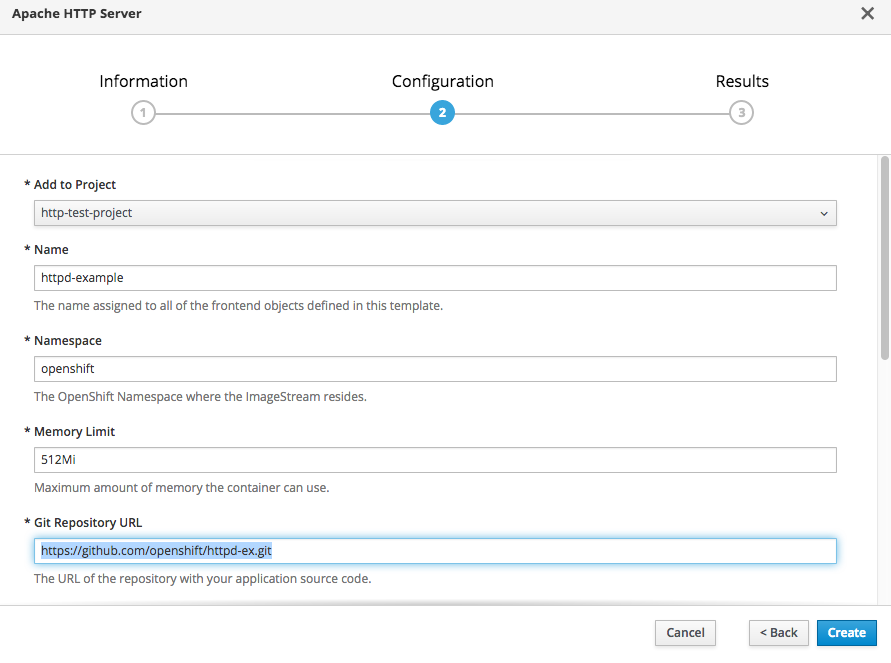
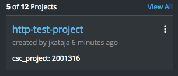
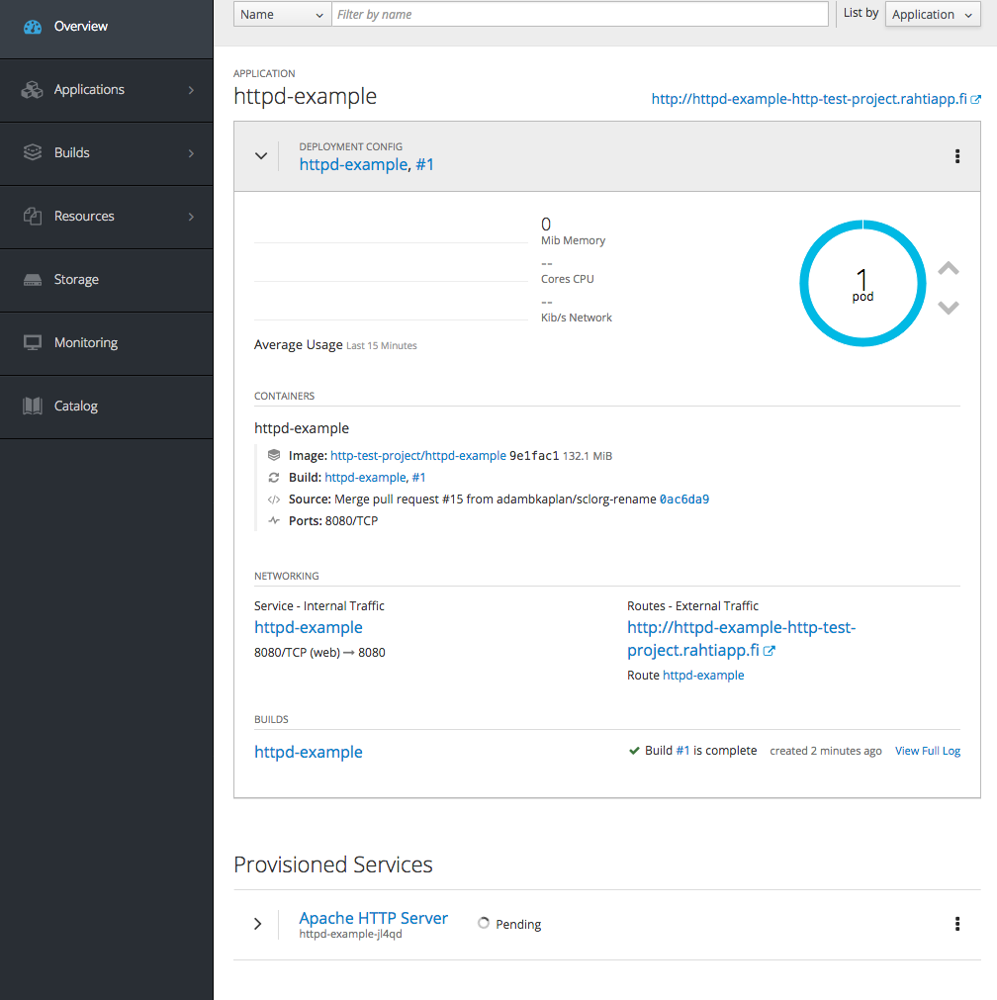

# Static web server

This tutorial guides how to set up a static web server in Rahti.

1.  Create project. For instructions how to do that, see
    "[Projects and quota ](../../usage/projects_and_quota/#projects_and_quota)".

2.  On the catalog screen, select "Apache HTTP Server".
    

3.  Type in the source Git repository containing the content to be
    served. Here, the sample content is used and the application
    is created in a project called "http-test-project".
    

4.  Click "Create". Then navigate to the newly created
    project: 

    If you've already navigated to the project view
    previously, select "Overview" from the menu on the left.

5.  Now the OpenShift dashboard should display information about the application.
    This application is available at 
    [httpd-example-http-test-project.rahtiapp.fi](http://httpd-example-http-test-project. rahtiapp.fi)
    

What happened here was that OpenShift processed a template that provisioned
various objects, such as *Pods*, *Services*, *Routes*, *DeploymentConfigs*, and
*Builds* in to the container cloud and as a result a web server emerged.

For deeper insight in to the created objects, please see

* [Core objects](elemental_tutorial) for introduction to fundamental objects on
  which OpenShift/Kubernetes applications are built upon.
* [Utility objects](advanced_tutorial) how managing application in
  OpenShift/Kubernetes further streamlined using higher abstraction level objects.
