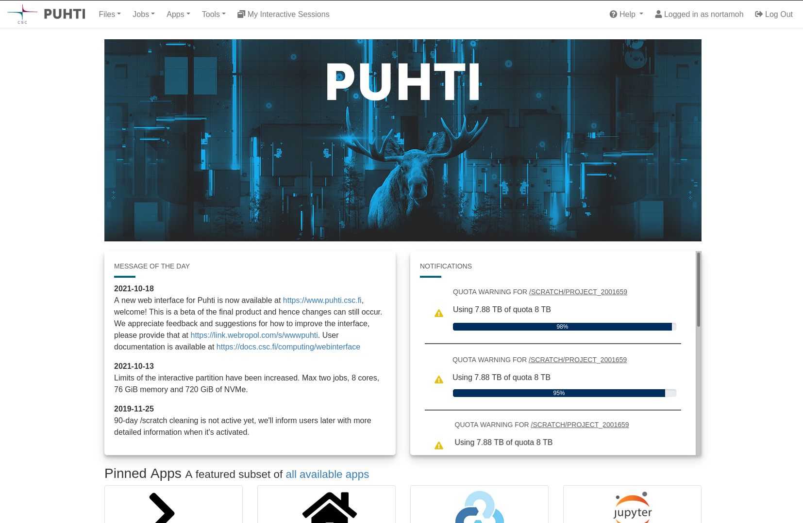

# Getting started with machine learning on Puhti

*You have some machine learning code in Python running on your laptop, but it's
really slow. You've learned that moving to GPUs and CSC's Puhti supercomputer
might be the answer but the documentation seems a bit daunting.*

CSC's computing environment is well-documented at
[docs.csc.fi](https://docs.csc.fi), but for a newcomer it might be a bit
difficult to know how to get started. **This guide will show you, step by step,
how to get your codes and data to Puhti and running on GPUs**.

When you are moving your code from your laptop to the Puhti supercomputer, it's
important to acknowledge that Puhti isn't just a "faster laptop". Because of the
fundamental difference in scale, some things work quite differently in a
supercomputer. So **be prepared to take a step back and relearn some things
about how computing is done**. We consider this a reasonable price to pay for
getting access to Finland's most powerful GPU resource for researchers!

## Step 1: getting a CSC user account

First of all, you need to get a CSC user account. If you work or study at a
Finnish university just **go to the My CSC portal at
[my.csc.fi](https://my.csc.fi) and click "Get Started"**. Select Haka-Login and
your university from the pull-down menu. After that you should be able to log in
with your normal university credentials. Fill in your information on the *Sign
up*-page. Once you're done, you should get a confirmation email.

For more information, and special cases, check our separate ["How to create new
user account" documentation](../../accounts/how-to-create-new-user-account.md).

## Step 2: join an existing project, or create a new one

Second, you need to belong to a computing project. This is because CSC needs to
keep track of how our resources are used, and computing projects are the
mechanism for that. 

If you are part of a research group, **ask your professor or group leader if you
already have a CSC project that you can join**. If that is the case the manager
of the project (most likely the professor) can add you to the project via the
[My CSC portal](https://my.csc.fi). Check our more [detailed documentation on
how to add a new user to a
project](../../accounts/how-to-add-members-to-project.md)

Otherwise, for example if you are working on your own doctoral thesis project,
you can create your own project. **To create a new project, go to [My
CSC](https://my.csc.fi)** and log in as in Step 1 above. Choose *My Projects*
and click the *New project* button. Give your project a name, and describe
briefly the research you are doing. "Academic" is probably the appropriate
category in most cases. For more information, check our "[Creating a new
project" documentation](../../accounts/how-to-create-new-project.md).

## Step 3: logging in to Puhti

There are many ways to access Puhti. The traditional way is via an SSH client
giving you a purely text based command line access to the Linux system running
on Puhti. However, here **we recommend the Puhti web interface accessible via a
web browser at [puhti.csc.fi](https://www.puhti.csc.fi)**. Log in with the
username and password created in Step 1 of this guide.

!!! note

    If you have just created your account minutes ago, it might be that it
    hasn't yet been activated on Puhti. Just go get a coffee and try again in a
    few minutes! ☕

After logging in, you will see the Puhti web interface, which looks something
like this:

## Step 4: Copy your code to Puhti

The main things to check for now are:

- The *Files* menu, it should show several disk areas for your use:
  - *Home Directory*, which is your personal area with quite limited storage
  - `projappl` directory for each project, which is meant for your
    project-specific code and important files
  - `scratch` directory for each project, which is meant for temporary
    project-specific files such as large datasets (*but don't keep your only
    copy here!*)

- The *Tools* → *Login node shell* to start a terminal session on Puhti. From
  here you can launch jobs

<!-- ## Step xx -->

<!-- PyTorch code from github, CIFAR data? Own code, or from recent paper? -->
<!-- `pip install --user`? -->

<!-- ## Step nn: slurm -->

<!-- Puhti is a supercomputer cluster, which means that it's a collection of hundreds -->
<!-- of computers. Instead of running programs directly, they are put in a queue and -->
<!-- a scheduling system (called "Slurm") decides when and where the program will -->
<!-- run. -->

<!-- - gputest -->

<!-- ## Step last: check results -->

<!-- Check slurm*out etc etc. -->
